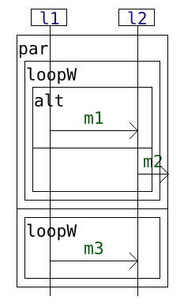

# A small experiment to recognize slices of multi-traces using parameterized simulation with HIBOU

Multi-traces are sets of local traces, each corresponding to a sequence of communication actions (emissions or receptions of messages) 
that are observed locally on a specific sub-system or set of co-localized sub-systems. 
A multi-trace is hence a collection of local observations of the same global behavior (which is what was executed in the distributed system).

Under conditions of partial observation, observation might have started too late or ended too early one any one of the local observers that are tasked with logging the different component (local traces) of the multi-traces.
Hence what might be obtained instead of a fully-observed multi-trace is a slice (in the sense of slices of a word) of this unobserved multi-trace.

As a side note, this notion of partial observation can be linked to the absence of synchronisation mechanisms in between distant observers, which may not be able
to ensure having similar periods of observation.

As a specification language for assessing the conformance of multi-traces logged during the execution of a distributed system, 
we use a language of "interactions".
Interactions are formal models,
akin to Message Sequence Charts or UML Sequence Diagrams for their graphical representation,
but more related to process algebra for their structure and the manner in which we exploit them, via an operational-style semantics.

We then propose an algorithm for verifying multi-traces against interactions. 
This algorithm must be tolerant to the absence of synchronisation between distant observers.
Hence it must be able to recognize slices of accepted multi-traces
(accepted multi-traces corresponding to fully observed behaviors that are exactly specified by the interaction specification).

This experiment constitutes a small-scale experimental validation of such an algorithm which is implemented in the HIBOU tool
(see "[hibou_label](https://github.com/erwanM974/hibou_label)").

## Principle of the experiment

For every interaction *i* a set of interactions *I*, 
we generate a number of accepted multi-traces 
using the semantics exploration feature of HIBOU and a trace generation logger.

Those sets of multi-traces *T(i)* are defined up to a certain architecture of the system specified by interaction *i*.
This architecture corresponds to defining which sub-systems are co-localized i.e. share a common clock.

For every such multi-trace, we then generate a number of slices by removing events at the beginning and/or the end of its local trace components.

Finally, we analyze every such slice against the original model to ensure that the algorithm indeed recognize them as slices of accepted multi-traces.

## Results

|                     |                                                         |                                                         |                                                         |
|---------------------|---------------------------------------------------------|---------------------------------------------------------|---------------------------------------------------------|
| interaction         |  |  |  |
| architecture        | { {l1} , {l2} }  | { {l1} , {l2,l3} }  | { {l1} , {l2}, {l3} }      |
| generation limit    | loop <= 4        | loop <= 3           | loop <= 30                 |
| generation kind     | exhaustive       | exhaustive          | partial random             |
| generation filter   | none             | none                | nodes <= 10 000            |
| number of traces    | 1249             | 64                  | 231                        |
| slicing             | exhaustive       | exhaustive          | 30 random slices per trace |
| number of slices    | 115 929          | 80 488              | 7161                       |
| size of slices      | 0-8              | 0-22                | 24-123                     |
